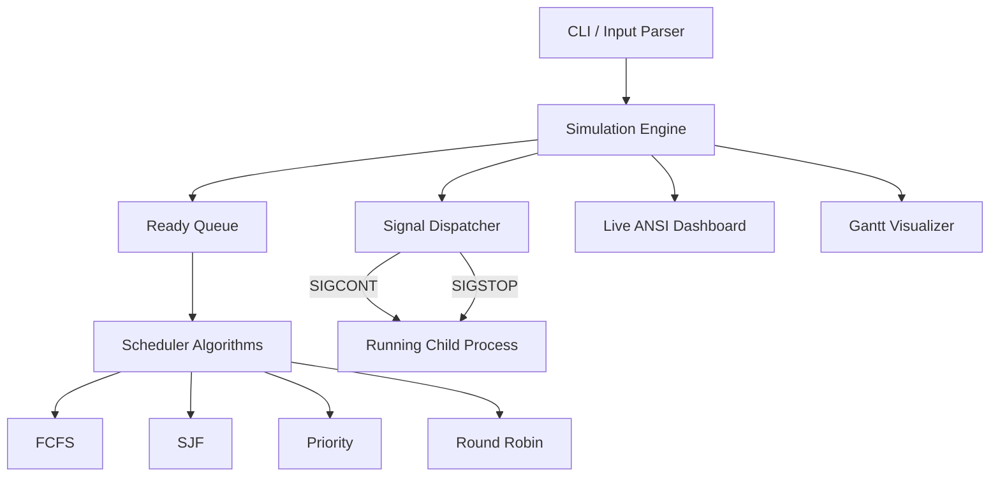

# OS Process Scheduler & Signal Management Engine

> A POSIX-compliant CPU scheduler simulation engine demonstrating robust process state management, preemption via signals, and interactive Gantt visualizations.

## System Architecture & Flow



### Clock Tick Lifecycle
1. **Queue Evaluation:** The engine evaluates the current global clock against process arrival times to dynamically update the Ready Queue.
2. **Process Dispatch:** The selected scheduling algorithm identifies the next process to execute, either forking it (if entirely new) or dispatching a `SIGCONT` signal (if paused).
3. **Dashboard Render:** The Live Dashboard clears the terminal using ANSI escapes, painting the `[RUNNING]` process and the `[READY QUEUE]` state in real-time.
4. **Execution & Preemption:** The clock advances, Gantt history is recorded, and if an interrupt occurs (e.g., a Round Robin time quantum expires), a `SIGSTOP` signal safely pauses the child process to yield the CPU.

## Tech Stack & Engineering Decisions

| Layer/Component | Technology | Rationale & Trade-offs |
|-----------------|------------|-----------------------|
| **Core Engine** | C (C99) | Grants absolute low-level control over memory, POSIX syscalls, and process hierarchies. |
| **Context Switching** | POSIX Signals (`SIGSTOP`/`SIGCONT`) | Replicates true OS preemption natively rather than mocking concurrency with threads. *Trade-off:* Requires rigorous signal masking logic to prevent deadlocks. |
| **UI/Visuals** | ANSI Escape Codes | Provides lightweight, dependency-free in-place updating for the Live Dashboard without the bloat of `ncurses`. *Trade-off:* Assumes a modern, ANSI-compliant terminal emulator. |
| **Memory Management**| Static Pre-Allocation | Relies on statically allocated state structures rather than dynamic `malloc`/`free`. Guarantees a zero-memory-leak profile, critical for daemon-like simulations. |

## Resilience & Error Handling Patterns

Building a stable OS-level simulation requires deep resilience against edge cases:

- **POSIX Signal Masking:** Robust `sigprocmask` and `sigsuspend` synchronization patterns ensure async-signal-safety, guaranteeing the engine does not race or deadlock during asynchronous `SIGALRM` interruptions.
- **Strict Bounds Checking:** The Gantt chart visualizer dynamically enforces array bounds (`t < 10000`) preventing devastating buffer over-reads during abnormally long scheduling simulations.
- **EOF Graceful Degradation:** Event loops processing interactive standard input (e.g., `--step` mode) strictly validate for `EOF` streams (e.g., `Ctrl+D`), preventing fatal infinite CPU spins.
- **Orphan Process Cleanup:** Defensive process sweeping (via `SIGTERM`) executes strictly after each algorithm finishes, ensuring no zombie or rogue processes persist in the environment.

## Project Layout

```text
.
├── CPU-Scheduler.c     # Core simulation engine, signal dispatch, and scheduling algorithms
├── Makefile            # Standard GNU Make build definitions
└── README.md           # Architectural documentation and setup instructions
```

## Local Setup & Quickstart

> [!IMPORTANT]
> **OS Compatibility:** Because this engine relies on native POSIX system calls and signals (`fork`, `execve`, `SIGSTOP`, `SIGCONT`), it must be run in a UNIX-like environment. 
> - **Linux / macOS:** Works natively.
> - **Windows:** Must be run using **Windows Subsystem for Linux (WSL)**. It will not compile or run in standard Windows CMD or PowerShell.

```bash
# Clone the repository
git clone https://github.com/Avrhambi/CPU_Scheduler
cd CPU_Scheduler

# Build the executable
make

# Run the interactive dashboard in demo mode
./CPU-Scheduler --demo --step
```
